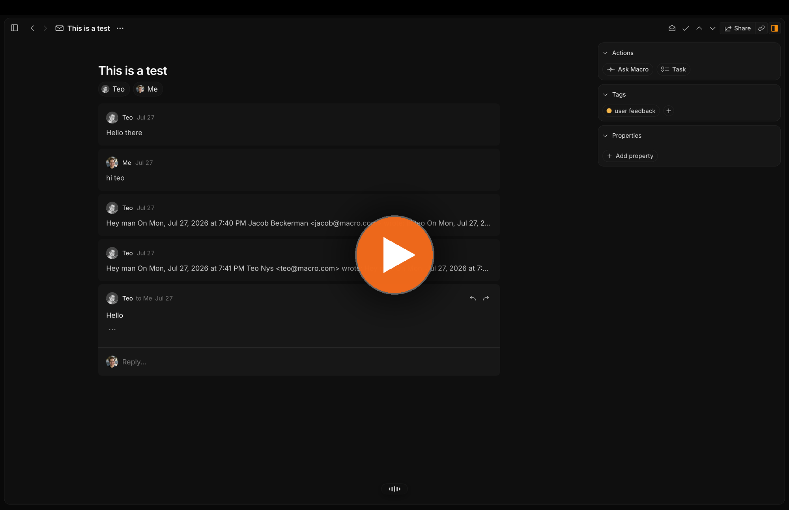
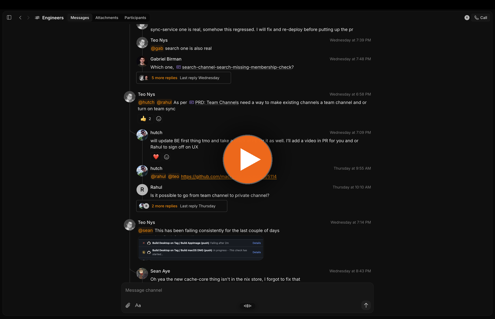
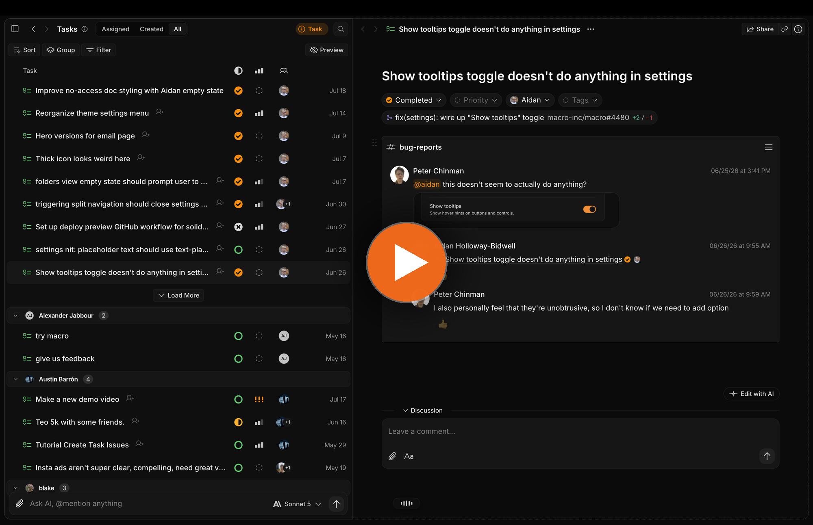
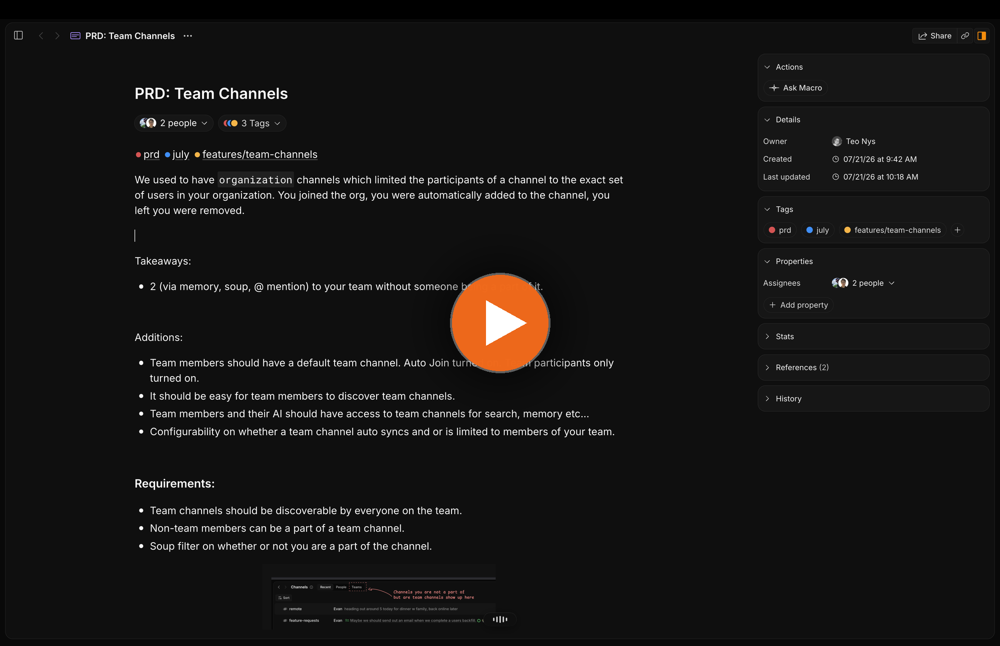
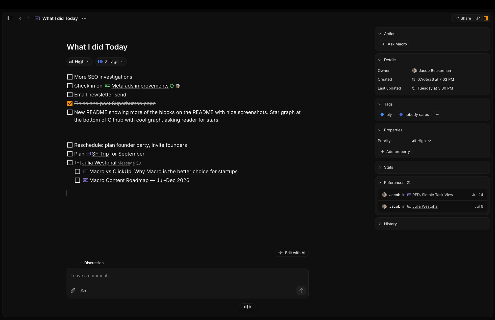
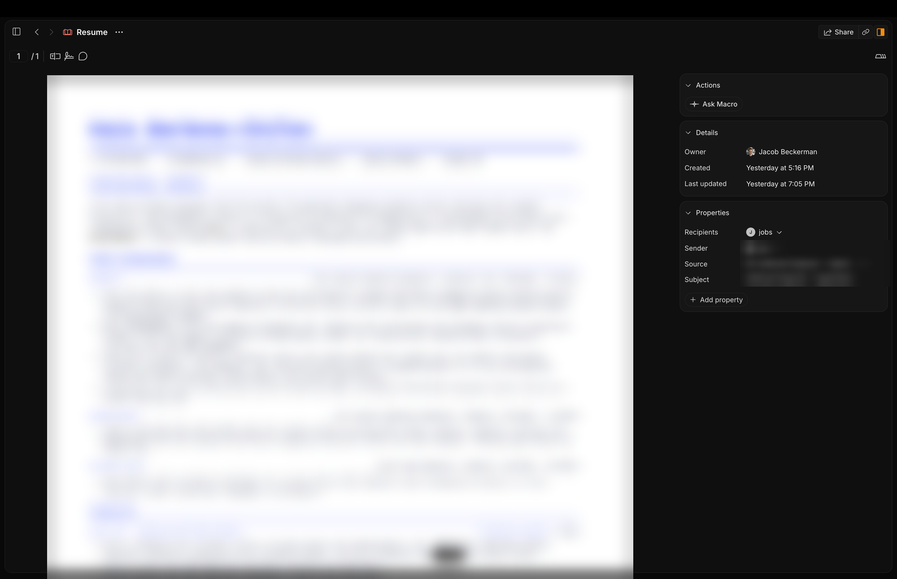
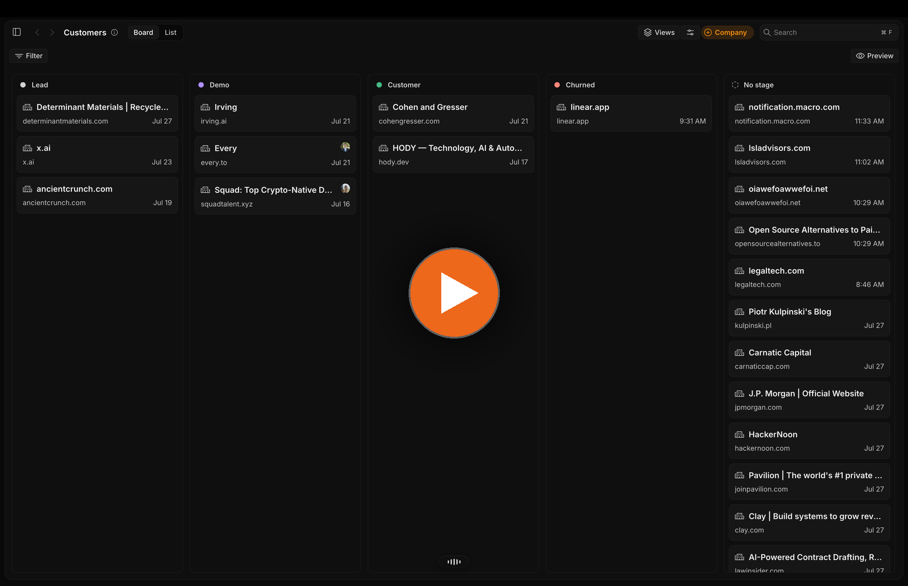
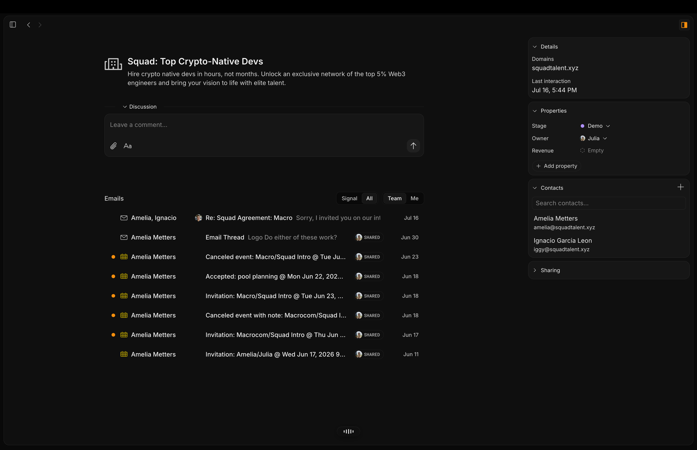
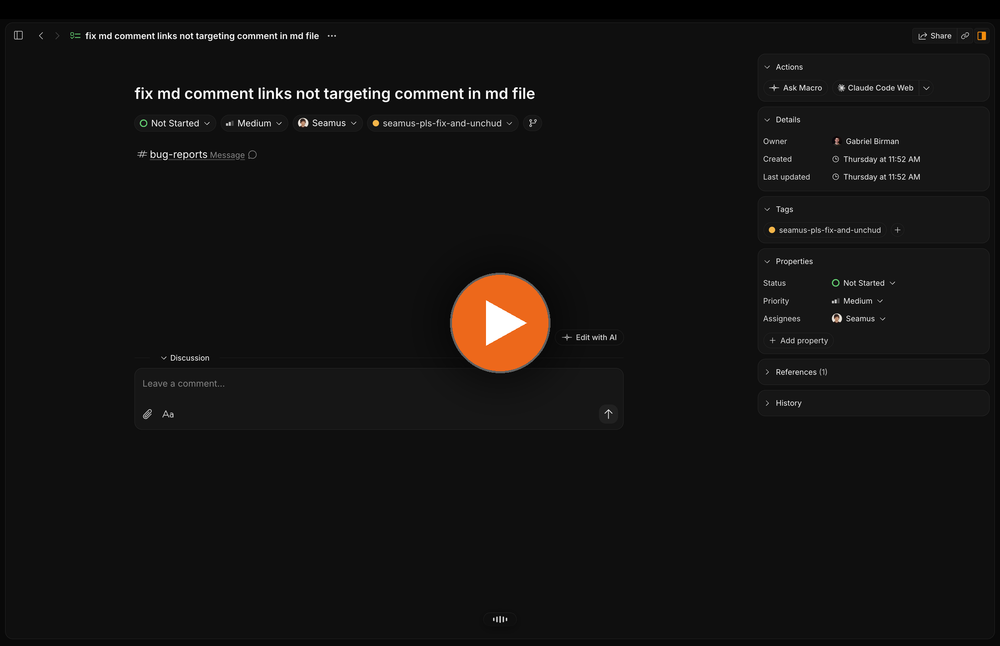
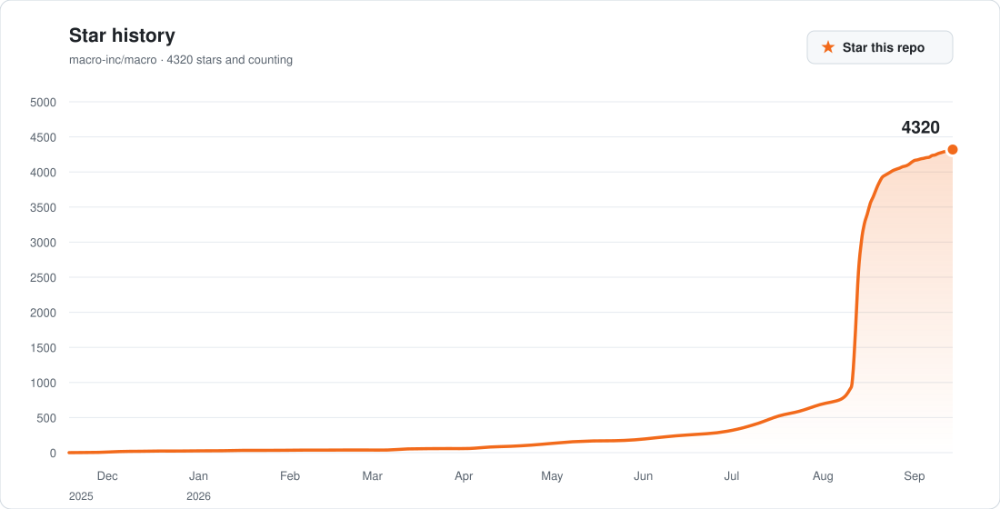

<div align="center">
  <a target="_blank" href="https://macro.com">
    
  </a>

  <p>
    <a href="https://macro.com/app">Sign up</a>
    ·
    <a href="https://docs.macro.com">Docs</a>
    ·
    <a href="https://cal.com/team/macro/macro-demo-call?metadata%5Bfbp%5D=fb.1.1778954074516.817396687896036613">Book demo</a>
    ·
    <a href="https://macro.com">Website</a>
    ·
    <a href="mailto:contact@macro.com">Feature requests</a>
    ·
    <a href="CONTRIBUTING.md">Contribute</a>
    ·
    <a href="mailto:teo@macro.com">Hiring</a>
  </p>
</div>


Macro is the all-in-one workspace that combines email, messages, docs, tasks, code, agents, calls, and CRM into a single fast interface. With shared team-level memory, everything in your workspace is @linked and queryable, so you and your agents never lose context.

Macro has raised $30m led by a16z. We are based in NYC.

## Stack

The backend is Rust — a Cargo workspace of 167 crates behind 42 deployable services. Services are `axum` over `tokio`, talking to Postgres through `sqlx` with compile-time-checked queries. There's an `async-graphql` layer for the client, `rdkafka` for the event bus, and `lambda_runtime` for the event-driven handlers. Search runs on OpenSearch, caching on Redis, blobs on S3, connection tracking on DynamoDB.

The client is SolidJS, not React — Tailwind 4, Vite, TanStack Solid Query. The editor is built on Lexical, and real-time collaboration runs on Loro CRDTs, so two people and two agents can edit a doc at once without a central lock. The same app ships to the browser, to desktop, and to mobile through Tauri.

A Nix flake pins the toolchain (Rust 1.94, Bun 1.3, sqlx, zig). `just` drives everything else.

### Quick start

```bash
git clone https://github.com/macro-inc/macro.git
cd macro
nix develop          # Rust toolchain, Bun, sqlx, zig, cargo-zigbuild
just run_local       # local infra + backend services + proxy + frontend
```

`run_local` prints the frontend URL once the stack is up. Press `r` to rebuild and reload changed Rust services, `q` to tear it down. Named instances (`--instance foo`) let you run several stacks side by side across worktrees. See [Running locally](docs/RUNNING_LOCALLY.md) for Doppler setup and the no-Doppler path.

```bash
just check                    # type check the workspace
just clippy                   # lints
just test                     # full test suite
cargo test -p email_service   # a single service
```

### Repository layout

```
macro/
├── apps/
│   ├── web/       SolidJS client — browser, Tauri desktop, mobile
│   └── docs/      docs.macro.com
├── services/      42 deployable services, workers, and Lambda handlers
├── crates/        167 Rust libraries — domain logic, models, db clients
├── packages/      shared TypeScript — collaboration, lexical-core, loro-mirror
├── infra/         Pulumi definitions
├── docker/        local Compose stack
├── nix/           pinned dev shell and build inputs
└── tooling/       repo scripts and code generators
```

The Cargo and Bun workspaces are both rooted at the top level. Services follow a hexagonal layout — inbound adapters (axum handlers, tool handlers, listeners), a domain core with ports, and outbound adapters (db clients, external APIs). [`docs/STYLE_GUIDE.md`](docs/STYLE_GUIDE.md) has the conventions, [`docs/CLOUD_STORAGE.md`](docs/CLOUD_STORAGE.md) covers the storage architecture, and [`CONTRIBUTING.md`](CONTRIBUTING.md) covers the PR process.

## Features

Every block below is the same underlying entity, which is why any of them can @link to any other. Full product docs are at [docs.macro.com](https://docs.macro.com).

### Email

The fastest, smartest email client — the best of Superhuman, Gmail, and Outlook in one keyboard-first inbox. Multi-account and unified, with shared inboxes for support@ and sales@ so a thread is never stuck in one person's mailbox.

Threads are first-class entities, so you can tag them, hang custom properties off them, and filter on those properties like a database. Turning a thread into a task or a doc takes one keystroke, attachments land in file storage automatically, and the whole thing stays searchable.



### Messages

Channels and DMs for teams that spend the day in technical discussion. Threads keep side conversations from burying the main one, and GitHub checks, PRs, and deploys render inline so triage doesn't mean tab-hopping.

Because channel membership is also the permission model, @mentioning a doc in a channel shares it with everyone there — no separate sharing step to forget.



### Tasks

Keyboard-first tasks built around the messages that created them. A bug report in a channel becomes a task in one keystroke and keeps the original conversation attached, so nobody has to re-explain context in a tracker that lives somewhere else.

- Sort, group, and filter by assignee, status, priority, or any custom property.
- Linked pull requests show live status and diff size on the task itself.
- Agents pick up, work, and close tasks alongside the rest of the team.



### Docs

Collaborative, version-controlled, markdown-native docs, built on CRDTs so several people and several agents can edit at once. Backlinks are automatic — the References panel on any doc lists everywhere it's been mentioned, which is how a workspace turns into a navigable graph instead of a folder tree.

Checklists, tags, and properties are enough to make a doc into a plan or a spec without reaching for another tool.





### File storage

Files arrive on their own — imported from email and channels, indexed by content rather than filename, and readable in place. PDFs open in a real viewer with comments and annotations, and every file keeps a pointer back to the message it came in on.



### CRM

Contact and company objects with custom properties, email sync, and enrichment. Since email already lives in Macro, the pipeline updates itself rather than asking anyone to log activity, and a company record shows the whole team's correspondence instead of only yours.

Board and list views group by any property — stage, owner, revenue — and records @link to the threads, docs, and tasks around them.





### Agents

Team-level memory is what makes the agent useful: it can see email, messages, tasks, docs, files, and calls, scoped to exactly the permissions you have. That makes it the most knowledgeable "person" at the company, and it acts rather than just answers.

Coding agents get the same access. Hand a task to Claude Code straight from the task view and it opens a branch and reports back on the task itself; point any MCP client at your workspace and it can read and write the same graph.



### Also included

Canvas is a 2D board with embedded @links, for planning that doesn't fit in a list. Calls are recorded, transcribed, and logged to team memory. Pull requests link to tasks and embed in channels. All three are documented at [docs.macro.com](https://docs.macro.com).

## How it holds together

Four ideas make the blocks above behave as one system rather than ten apps in a trench coat.

**Everything @links, in both directions.** @mention a doc in a message and each one knows about the other. The doc's References panel shows every place it's been mentioned, so context accumulates instead of scattering — and agents traverse the same graph you do.

**Channel membership is the permission model.** Anything @mentioned in a channel is shared with that channel's members. Join, gain access; leave, lose it. There is no separate sharing dialog and no permission-request dance.

**Memory is team-level, not per-user.** Agents see what the whole team is doing across email, messages, tasks, docs, and calls — refreshed nightly — instead of only your own chat history. That's the difference between an assistant that knows you and one that knows the company.

**One inbox, split into Signal and Noise.** Emails, channel messages, task assignments, @mentions, and agent responses land in the same place, keyboard-first throughout.

Deeper reading: [key concepts](https://docs.macro.com/concepts/blocks) covers blocks, mentions, properties, and permissions; the [FAQ](https://docs.macro.com/faq) covers comparisons, licensing, and self-hosting.

## Using the hosted app
 
[Sign up](https://macro.com/app) and connect your Gmail or Google Workspace account. Macro runs in any modern browser, with an [iOS app](https://apps.apple.com/us/app/macro-app/id6743133649) for your phone. The [getting started guide](https://docs.macro.com/getting-started) takes you from a fresh account to a working setup in about 15 minutes. Coming from Notion, Slack, Superhuman, or Linear? See [Switch to Macro](https://docs.macro.com/switch-to-macro).
 
## Agents & MCP
 
Your coding agents can use Macro too. Point Claude Code, Codex, or any MCP client at your workspace:
 
```bash
claude mcp add --transport http macro https://mcp-server.macro.com/mcp
```
 
See [MCP setup](https://docs.macro.com/AI/mcp/overview) and [agent recipes](https://docs.macro.com/AI/recipes) for what they can do once connected.

# Security


Enterprise-grade security. Zero data retention with model providers, including no training on customer data. SOC 2 Type II certified. We welcome responsible security reports and pay bounties in accordance with severity and impact. Send reports to [security@macro.com](mailto:security@macro.com).

# License

Macro is fully open source — not "open core" — under the GNU Affero General Public License v3.0. See `LICENSE.txt` for details.

You can self-host Macro under the terms of the AGPLv3; the [FAQ](https://docs.macro.com/faq) covers what that involves. If you want to build on top of Macro under a different license, contact [licensing@macro.com](mailto:licensing@macro.com). For managed hosting or commercial arrangements, contact [self-host@macro.com](mailto:self-host@macro.com).

# Community

Have an idea, want to contribute, or want to work on Macro?

- Feature requests: [contact@macro.com](mailto:contact@macro.com)
- Contributions: see our [contribution guidelines](CONTRIBUTING.md)
- Hiring: [teo@macro.com](mailto:teo@macro.com)

<a href="https://github.com/macro-inc/macro">
  <picture>
    <source media="(prefers-color-scheme: dark)" srcset=".github/readme/star-history-dark.svg" />
    
  </picture>
</a>

If Macro is useful to you, starring the repo helps other people find it.

<div align="center">
  <a target="_blank" href="https://macro.com/app">
    
  </a>
</div>
